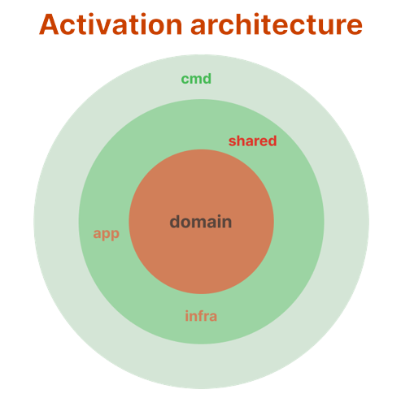
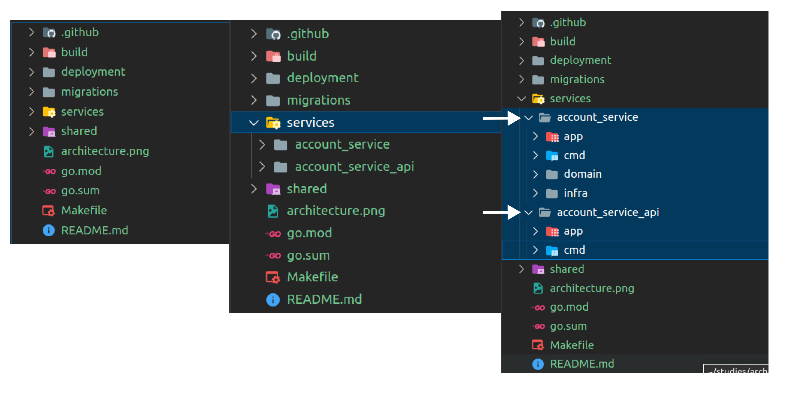

  <h2 align="center">Activation Architecture</h2>

## Problemas a resolver:
- Remover complexidade da estrutura do repositório, separar código fonte de arquivos e pastas de environment, build, bin, deployment etc...
- Usar uma abordagem de modelagem de software.
- Abstrair a lógica de negócio (domínio). 
- Reduzir acoplamentos, aumentar coesão.
- Adicionar padrão arquitetural.

## Premissas:
- Monorepo
- Arquitetura Microserviços
- Manter padrão idiomático (considerar padrões da comunidade)
- Simplicidade (Estrutura organizacional de pastas)
- Arquitetura Orientada ao Domínio
- Desacomplamento
- Testabilidade
- Manutenabilidade

## Sugestão: 
 Uma arquiteruta usando conceritos do padrão <b>Ports and Adapters</b> e <b>DDD</b>  "customizada" :).
 
Utilizando conceitos de ports and adapters com Domain Driven Design (DDD) nos permitirar criar uma arquitetura simples focada no domímio, que seja intuitiva e facilite a criação de novos serviços enxutos e manutenniveis, faceis de manter e evoluir.

 
Para conseguirmos esse feito, sugiro adicionarmos alguns Princípios e Padrões de Projetos tais como:

- <b>(DDD)</b>  Abordagem de modelagem de software, conceitos como linguagem ubíqua, Bounded Contexts, entity, aggregate, domain service, application service.
- <b>(Repository)</b>  O Repository Pattern permite um encapsulamento da lógica de acesso a dados, seja SQL ou NoSQL
- <b>(SRP)</b> Princípio da responsabilidade única, O arquivo / função deve possuir apenas uma responsabilidde ou contexto.
- <b>(LSP)</b>  Liskov substitution, Polimorfismo, interfaces e implementações
- <b>(DIP)</b> Principio da inversão de dependência, uma forma eficiente de desacoplamento de módulos, inversão das relações de dependências.

## Representação gráfica:

## Estrutura de Pacotes/Pastas:

- <b>(services</b> Pasta dos serviços. Um nível acima desta fica a pasta infra, shared e todas as pastas e arquivos de build, deployment, env, go.mod, go.sum, Makefile, task,readme etc...

- <b>(shared)</b> Nesta camada colocaremos tudo o que for importado por outros módulos ou serviços.

- <b>(migrations)</b> Nesta pasta fica a implementação da lógica de migration e todos os arquivos de migrations de banco de dados.

## Estrutura de Pacotes/Pastas para cada serviço
- <b>(domain)</b> Camada que mantém os dominios do négocio, toda a lógica do problema a ser resolvido fica nesta camada, totalmente desacoplada das demais camadas, somente um nível de pasta seguindo o mesmo padrão da camada cmd, nome da pasta mesmo nome do serviço mesmo nome do pacote.

- <b>(app)</b> Nesta camada fica a application service, camada que faz parte do dominio, responsavel por toda a interação com o mundo externo, CLI, API Rest, gRPC Service.

- <b>(infra)</b> Nesta camada fica a implementação da lógica de interação com as outras camadas, banco de dados, filas, cache e outros serviços. Podemos ter até 2 níveis hierárquicos de pastas, o primeiro nível é o nome das subcamadas, database, bridges, amqp, migrations etc. E no segundo nível a pasta que representa o pacote Go

- <b>(cmd)</b> Camada seguindo o padrão da linguagem Go, somente um nível de pasta, uma pasta para cada serviço (nome da pasta o mesmo nome do serviço), entrypoints do serviço, pacote main.
